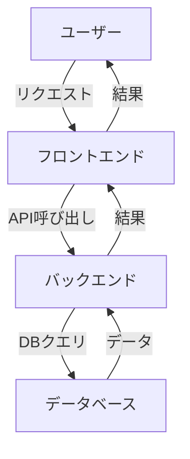
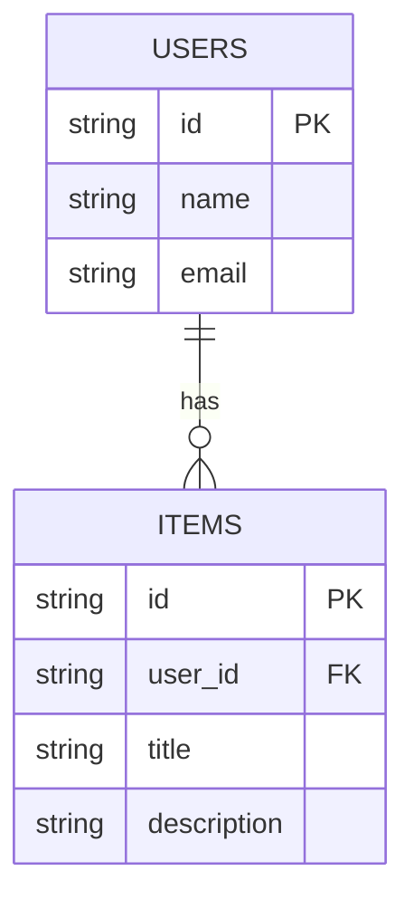
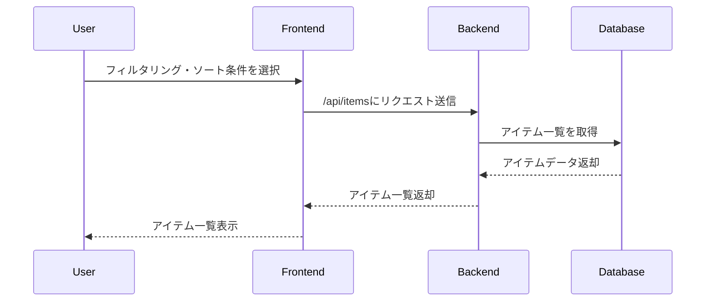

---

# Design Doc: 一覧

## 1. 概要
このドキュメントは、「一覧」機能を実装するための詳細な設計を提供します。システム要件、アーキテクチャ、データモデル、API、処理フローなどが含まれます。

## 2. システム要件
- 機能要件
  - 一覧表示機能
  - フィルタリング機能
  - ソート機能
- 非機能要件
  - パフォーマンス: 1000件までのデータを1秒以内に表示
  - 可用性: 99.9%以上の稼働率
  - セキュリティ: データ暗号化

## 3. アーキテクチャ
### 3.1 システム構成図


### 3.2 コンポーネント説明
- **ユーザー**: システムの利用者
- **フロントエンド**: UIを提供し、ユーザーからの入力を受け取る
- **バックエンド**: ビジネスロジックを処理し、データベースと連携する
- **データベース**: データを永続化して保存する

## 4. データモデル
### 4.1 ER図


### 4.2 テーブル定義
- **USERS**
  - id: VARCHAR(255) PRIMARY KEY
  - name: VARCHAR(255) NOT NULL
  - email: VARCHAR(255) NOT NULL UNIQUE
  
- **ITEMS**
  - id: VARCHAR(255) PRIMARY KEY
  - user_id: VARCHAR(255) FOREIGN KEY REFERENCES USERS(id)
  - title: VARCHAR(255) NOT NULL
  - description: TEXT

## 5. API仕様
### 5.1 エンドポイント一覧
| メソッド | パス          | 説明                     |
|---------|--------------|-------------------------|
| GET     | /api/items   | アイテムの一覧を取得   |
| POST    | /api/items   | 新規アイテムを追加する   |
| GET     | /api/items/{id} | 特定のアイテムを取得   |

### 5.2 リクエスト/レスポンス例
#### アイテム一覧取得 (GET /api/items)
**リクエスト**
```json
{
  "filter": "all",
  "sort": "asc"
}
```
**レスポンス**
```json
[
  {
    "id": "1",
    "title": "アイテム1",
    "description": "説明1"
  },
  {
    "id": "2",
    "title": "アイテム2",
    "description": "説明2"
  }
]
```

## 6. 処理フロー


## 7. セキュリティ考慮事項
- 認証・認可: OAuth2.0を用いたユーザー認証
- データ保護: HTTPSを通じてデータ送信
- 入力バリデーション: APIへの全てのリクエストに対してバリデーションを実施

## 8. テスト方針
- 単体テスト: 各コンポーネントの機能テスト
- 結合テスト: フロントエンドとバックエンドの統合テスト
- E2Eテスト: ユーザーの視点からのシステム全体のテスト

## 9. 今後の課題・検討事項
- データベースのスケーラビリティ
- フロントエンドのパフォーマンス最適化
- ユーザビリティテストの実施

--- 

## 注意事項
- 具体的で実装可能な設計を心がけてください
- 不明点は合理的な仮定を置き、「【仮定】」として明記してください
- コード例が必要な場合は適宜追加してください